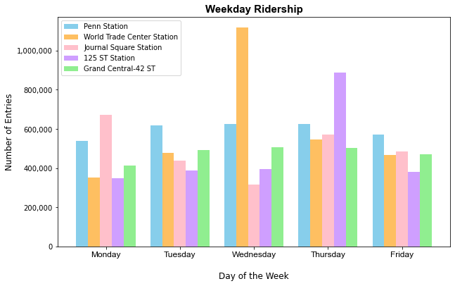
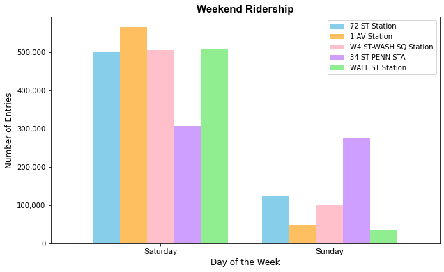

# Brand Awareness: Forecasting the Impact of Ridership at Subway Stations

## Abstract

Pop-up store became one of the popular marketing strategies that allow many companies to increase their brand awareness and offerings without long-term investment. The goal of this project is to use transit data from Metropolitan Transportation Authority in New York to help a California-based technology company increase brand awareness of their recently acquired gaming company. My findings, including visualizations, provide a solution for the company to target and optimize their pop-up stores at the top 5 subway stations with highest ridership.

## Design

The company is planning to launch pop-up stores during the first quarter of 2023. I use the datasets from January 2022 to March 2022 to help the company set a clear vision and execute a strategic plan of exhibiting pop-up stores next year. By gathering and analyzing the data, the company would be able to display their pop-up stores near the subway stations each day to achieve maximum brand exposure. 

## Data

The data is provided by Metropolitan Transportation Authority (MTA), a public transportation corporation in New York City. Datasets are collected from January 2022 to March 2022.

## Tools

- Connect Python to SQLite database using SQLAlchemy
- Matplotlib for data visualization
- Pandas for data analysis 

## Results

